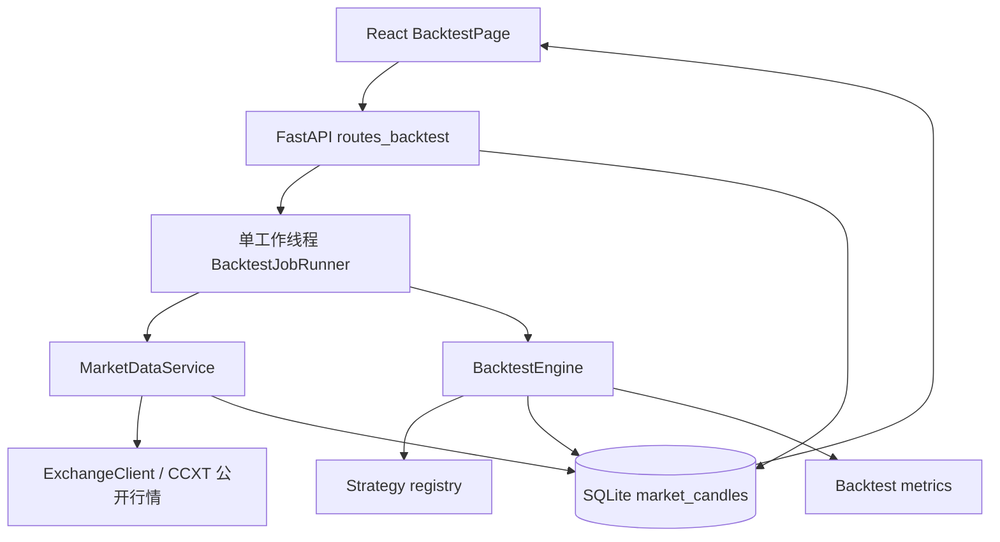

# 交易策略回测模块开发计划

> 状态：规划完成，待实施
>
> 编制日期：2026-09-08
>
> 评估基线：`feat/connection-check-and-live-price` / `2e0c10b`
>
> 范围：本地行情下载、可扩展策略、K 线级撮合与账户模拟、回测报告

本文用于把回测需求落实为可开发、可测试、可验收的方案，不表示回测功能已经实现。首期坚持 PosiHub 的本地优先、个人单用户和简单实现原则，不引入分布式任务队列、微服务或独立数据库。

## 1. 结论与首期方案

回测模块采用以下方案：

1. 继续使用现有 Python 3.12、FastAPI、SQLModel/SQLite、CCXT、React、Ant Design、TanStack Query 与 ECharts，不增加回测框架或数据分析框架依赖。
2. 行情通过 CCXT 的公开 `fetch_ohlcv` 能力获取，不依赖账户 API Key，也不调用任何下单、撤单、划转或提现接口。
3. K 线保存到当前本地 SQLite 数据库的新表中，以 `(exchange, market_type, symbol, timeframe, price_type, open_time_ms)` 唯一约束保证重复下载可安全覆盖和续传。
4. 回测域与真实账户域完全隔离。回测结果不得写入 `positions_current`、`position_orders`、`position_close_executions`、账户快照或现有绩效表。
5. 策略使用一个小型 Python 接口和显式注册表扩展。新增策略只需要新增策略文件、登记一个注册项并补测试，不做动态包扫描、在线代码编辑器或插件运行时。
6. 首个可验收执行范围是：**单交易所、单标的、单周期、U 本位永续、单向净仓模式，同时支持做多和做空**。行情下载可以兼容更多 CCXT 市场，但未通过契约测试的组合只标记为实验性。
7. 策略在第 `t` 根已收盘 K 线结束后产生意图，普通市价单最早在第 `t+1` 根 K 线开盘成交，禁止使用未来数据。
8. 首期提供全额成交的 K 线级模拟，并覆盖杠杆、保证金、maker/taker 手续费、手续费返佣、滑点、资金费、止盈止损和近似强平。盘口深度、排队顺序和真实部分成交不在首期伪装为“精确模拟”。
9. 下载和回测都按长任务处理：API 立即返回 `202 + job_id`，后端单工作线程串行执行，前端轮询进度。该方案解决现有 Axios 15 秒超时问题，同时符合单机 SQLite 的并发边界。
10. 报告保存完整配置、策略版本、引擎版本和数据指纹；相同输入必须得到相同结果。

## 2. 当前项目基线与复用边界

### 2.1 已有能力

| 范围 | 当前实现 | 回测模块处理方式 |
| --- | --- | --- |
| 交易所接入 | `backend/app/services/exchange/` 已封装 CCXT、限频、15 秒超时和指数退避 | 增加公开 OHLCV 能力，复用构建、重试和关闭连接逻辑 |
| 市场标准化 | `RawMarket`、`SymbolMapping`、现货/线性/反向账户类型已存在 | 数据集保留精确 CCXT symbol，同时可附带 canonical symbol |
| 数据存储 | SQLModel + SQLite，启动时 `create_all()` | 只新增表，不修改现有表字段；现有数据库可创建缺失表 |
| 长任务 | APScheduler 用于账户同步与日快照 | 回测任务不依赖加密密钥或 Scheduler，使用独立的单工作线程 |
| 绩效计算 | 已有权益、回撤、Calmar、胜率、Profit Factor、连续盈亏等算法 | 复用纯函数；数据库耦合的真实账户查询不复用 |
| 前端请求 | Axios + TanStack Query，全局超时 15 秒 | 提交任务只等待短响应，状态和报告通过查询接口轮询 |
| 图表与组件 | ECharts 主题、`KpiCard`、`PnlText`、`SideTag`、CSV 工具已存在 | 复用视觉规范和通用组件，不复制现有 Performance 页面 |
| 国际化 | 导航、总览和设置页已有中英文消息对象 | 回测新增文案同时补齐 `zh-CN` 与 `en` 键 |

### 2.2 必须保持的边界

- PosiHub 仍然不向交易所发出真实交易请求；“订单”仅指本地模拟订单。
- 公开行情下载不得解密或读取账户凭据。
- 真实账户绩效与回测绩效使用不同表和不同 API 前缀，页面上也必须明确标识“模拟结果”。
- 现有 `PerformancePage` 的统计口径来自真实快照和平仓事件，不能直接接受回测 run id。
- 首期继续支持单进程本地部署。若未来启用多个 Uvicorn worker，必须先把任务执行器迁移到独立 worker/队列。

## 3. 目标、范围与非目标

### 3.1 用户目标

用户应能完成以下闭环：

1. 选择交易所、市场类型、标的、价格类型、K 线周期以及起止日期。
2. 查看交易所实际支持的周期，并将指定区间的已收盘 K 线下载到本地。
3. 查看本地覆盖范围、K 线数量、重复数、缺口和未收盘 K 线警告。
4. 选择已注册策略，按策略元数据填写参数。
5. 设置初始资金、杠杆、仓位比例、保证金模式、手续费、返佣、滑点、资金费和强平参数。
6. 异步启动回测并查看排队、下载、计算、保存等进度。
7. 查看行情上的多空开平仓点、每笔盈利/亏损、权益/回撤曲线、成本拆分、统计指标和交易明细。
8. 保存并重新打开历史 run，确认当时使用的数据与参数；导出交易明细 CSV。

### 3.2 首期必须覆盖

- Bitget 与 Bybit 公开 K 线下载的契约测试；其他 `has['fetchOHLCV']` 为真的 CCXT 交易所走通用能力探测。
- 直接下载交易所原始周期，不在客户端自行重采样。
- `[start, end)` UTC 区间语义、分页、限频、重试、去重、续传和完整性检查。
- U 本位永续单标的回测，支持 long、short、flat 三种目标状态。
- 下一根 K 线开盘成交、权益比例仓位、止盈、止损、反手和平仓。
- 手续费、返佣、固定滑点、固定资金费、维持保证金和近似强平；历史资金费在 Phase 4 补齐。
- 完整 run 配置、权益点、模拟成交、闭合交易、指标、警告和数据指纹持久化。
- 响应式回测配置页、任务进度与详细报告页。
- 后端单元/API 测试、前端关键转换测试和至少一个可重复的基准策略。

### 3.3 首期明确不做

- 实盘下单、模拟盘下单、跟单或把策略接入 Scheduler 自动运行。
- 在线上传/编辑并执行任意 Python 代码；自定义策略只从受信任的本地仓库代码加载。
- 多标的组合、跨交易所套利、期权、交割合约到期换月、现货融资借币和反向合约精确账务。
- 参数网格搜索、遗传优化、Walk-forward、蒙特卡洛或机器学习训练。
- Tick、逐笔成交、盘口回放、真实撮合队列、网络延迟和基于盘口的部分成交。
- 把第三方回测框架引入核心执行路径。
- 分布式执行、Redis、Celery、消息总线或单独部署的行情服务。

## 4. 用户流程与页面结构


前端新增一级导航“策略回测”，页面内用三个步骤组织，不再增加多个一级页面：

1. **行情数据**：数据选择器、覆盖情况、下载/补全按钮和任务进度。
2. **策略与模拟配置**：策略参数、账户配置、成本与风控配置、运行前校验。
3. **回测报告**：指标卡、联动图表、分组统计、交易表和可复现信息。

历史 run 列表放在同一页面右上角抽屉或下拉选择中，首期不单独建设“回测管理中心”。

## 5. 总体架构



模块职责：

- `exchange`：只负责交易所能力、市场元数据与标准化 OHLCV，不包含回测规则。
- `backtest.data`：负责时间边界、分页、去重、覆盖和本地存储。
- `backtest.strategy`：定义策略契约、参数元数据、上下文和订单意图。
- `backtest.engine`：负责时序、撮合、持仓、现金、保证金、成本、资金费和强平。
- `backtest.metrics`：只接收内存中的权益点和闭合交易，输出纯统计结果。
- `backtest.jobs`：串行执行长任务并更新持久化进度。
- API/前端：只做校验、编排和展示，不复制核心计算。

## 6. 行情下载与本地数据

### 6.1 数据选择维度

每个数据集由以下维度唯一确定：

| 字段 | 示例 | 说明 |
| --- | --- | --- |
| `exchange` | `bitget` | CCXT exchange id 的快照，不依赖账户记录长期存在 |
| `market_type` | `linear` | 首期允许 `spot`、`linear`、`inverse` 下载，回测只保证 `linear` |
| `symbol` | `BTC/USDT:USDT` | 使用 `load_markets()` 返回的精确 CCXT symbol，不让用户手输猜测 |
| `canonical_symbol` | `BTC-USDT-PERP` | 可选展示字段，复用映射但不作为数据唯一键 |
| `timeframe` | `5m` | 必须存在于交易所 `timeframes` 中；首期只接受可换算为固定时长的周期 |
| `price_type` | `trade` | 下载允许 `trade`、`mark` 或 `index`；首期回测主行情必须为 `trade` |
| `start` / `end` | ISO 8601 | API 接受带时区时间，内部转换为 UTC，采用 `[start, end)` |

UI 的日期选择按 `APP_TIMEZONE` 解释，但数据库和下载游标统一使用 UTC Unix 毫秒。API 输出再转换为带时区的 ISO 8601。日线边界采用交易所返回的原始开盘时间，不按本地午夜重采样。月线等非固定时长周期首期不开放，避免用错误的固定毫秒数推进游标。

### 6.2 下载算法

1. 根据本地 `Exchange` 记录构建无密钥 CCXT 客户端，开启现有 `enableRateLimit` 和重试。
2. 调用 `load_markets()`，验证市场、市场类型和 `has['fetchOHLCV']`；周期必须来自该实例的 `timeframes`。
3. 保留用户的原始 `[start, end)`；只把内部抓取起点向下、抓取终点向上扩到周期边界，最终仍按原始范围严格裁剪。
4. 每页显式传入 `since`，不依赖交易所默认时间范围；页大小由适配器按交易所能力确定。
5. 将返回值标准化为按开盘时间升序的 `[timestamp, open, high, low, close, volume]`。
6. 严格裁剪到 `[start, end)`，以唯一键去重，按页执行 upsert 并更新任务进度。
7. 下一页游标使用本页最大 `open_time + timeframe_ms`。若响应为空、游标不前进或超过内部抓取终点，停止，避免死循环。
8. 默认不保存仍未收盘的最后一根 K 线；用户请求包含当前周期时返回警告。
9. 下载失败后保留已提交页面。再次提交相同范围会从覆盖缺口继续补齐，不产生重复 K 线。
10. 最终重新查询数据库生成覆盖报告，而不是用接口返回条数推断成功。

不直接启用 CCXT 的实验性自动分页；首期使用可测试的显式游标循环。Bitget/Bybit 的原始返回排序和范围差异由 CCXT 与本地裁剪共同消除。

### 6.3 数据校验

每根 K 线必须满足：

- 时间戳符合该适配器实现的周期锚点、严格递增且唯一；没有明确对齐规则的周期首期拒绝下载；
- `low <= min(open, close) <= max(open, close) <= high`；
- 价格为有限正数；volume 可以为空，存在时必须为有限非负数；
- 不接受 `NaN`、`Infinity`、错位字段或时间范围外记录；
- 当前未收盘 K 线不参与默认回测。

`volume` 只用于展示，不能假设所有交易所都使用相同单位。市场元数据将单位记录为 `base | quote | unknown`；首期成交模型不依据 volume 猜测可成交数量。

覆盖报告至少返回：

- 请求区间、实际首尾 K 线、预期数量、有效数量；
- 重复数量、非法数量、未收盘数量；
- 缺口数量和前 100 个缺口区间；
- 数据是否满足策略预热长度；
- 最近下载时间和数据指纹摘要。

连续交易市场默认 `gap_policy=reject`。用户可以显式选择 `allow` 运行，但报告顶部必须常驻数据缺口警告，且不得自动用前值或零成交 K 线填充。

### 6.4 市场数据现实边界

- 交易所可能限制低周期历史深度，指定日期不保证一定可下载；空结果必须显示“交易所无此区间数据”，不能视为成功。
- 缺失周期可能代表无成交，也可能是供应方缺口；系统只报告事实，不猜测原因。
- 当前 K 线收盘价仍会变化，因此默认排除。
- OHLCV 不包含买卖盘口、成交顺序和真实排队信息，无法精确推导同一根 K 线内先触发止盈还是止损。
- 退市标的或历史合约元数据可能无法从当前 `load_markets()` 取回；首期只支持当前仍可被 CCXT 解析的市场。

## 7. 策略扩展设计

### 7.1 最小策略契约

策略接口保持小而稳定：

```python
class Strategy(ABC):
    key: str
    name: str
    version: str
    parameters: tuple[StrategyParameter, ...]
    warmup_bars: int = 0

    def on_start(self, context: StrategyContext) -> None: ...

    @abstractmethod
    def on_bar(self, context: StrategyContext) -> list[OrderIntent]: ...

    def on_finish(self, context: StrategyContext) -> None: ...
```

`StrategyContext` 只暴露当前及过去已收盘 K 线和只读的账户/仓位快照，不暴露未来数组索引、数据库 session 或真实交易客户端。策略只通过 `on_bar()` 返回 `OrderIntent`：

- `target_side`: `long | short | flat`；
- `order_type`: 首期为 `market`，为未来 `limit | stop` 保留枚举但未实现类型必须拒绝；
- `size_fraction`: 可选的本次保证金比例；省略时使用 run 配置，且不能超过 1；
- 可选 `stop_loss_price`、`take_profit_price`；
- `tag`：策略自定义原因，用于报告归因。

### 7.2 参数元数据

每个策略声明参数的 `key`、类型、默认值、必填、最小/最大值、步长和说明。后端用同一份元数据完成 Pydantic 校验并返回给前端动态渲染，避免前后端各维护一份参数规则。

策略实例每次 run 新建，不允许模块级可变状态。参数在 run 开始后冻结并写入 `config_json`。

### 7.3 显式注册

`backend/app/services/backtest/strategies/__init__.py` 维护简单字典：

```python
STRATEGIES = {
    SmaCrossStrategy.key: SmaCrossStrategy,
}
```

新增策略流程：

1. 新增一个策略类；
2. 在字典中登记；
3. 为参数校验、信号时间和至少一个完整交易补测试；
4. 修改逻辑时提升 `version`；
5. 重启后端，前端会通过策略目录 API 自动显示新策略和参数。

首期附带 `sma_cross` 作为示例和端到端基准，不把它描述为盈利建议。

### 7.4 安全边界

策略代码与后端进程具有相同权限，因此只加载仓库中受信任代码。API 不接收源代码、文件路径、模块名或可执行表达式；策略 key 必须存在于注册表中。未来若要运行第三方策略，必须另行设计进程隔离、资源限额和依赖白名单。

## 8. 回测引擎与时序规则

### 8.1 逐根 K 线生命周期

对每根 K 线按固定顺序处理：

1. 用本根开盘价处理上一根收盘后产生的市价意图，并应用滑点、数量步长和手续费。
2. 若本根覆盖资金费结算时点，先按该时点可用的 mark/open 价格结算资金费并复查保证金。
3. 对已有仓位处理开盘跳空，再根据本根 high/low 检查强平、止损和止盈。
4. 使用本根收盘价计算未实现盈亏、保证金和权益，保存权益点。
5. 本根确认收盘后才调用策略 `on_bar()`；其新意图排到下一根开盘。
6. 最后一根结束后，按配置选择 `force_close_at_end=true` 在最后收盘价加滑点强制平仓，或保留未平仓并单列未实现盈亏。

策略预热 K 线可以早于报告 `start` 读取。引擎在预热期调用 `on_bar()` 让策略建立指标状态，但丢弃其订单意图，且预热期不得计入收益或报告区间；第一笔可执行意图只能在报告区间第一根 K 线收盘后产生。数据不足 `warmup_bars` 时拒绝运行。

### 8.2 成交和冲突规则

- 买入市价成交价：`reference_price * (1 + slippage_bps / 10000)`。
- 卖出市价成交价：`reference_price * (1 - slippage_bps / 10000)`。
- 首期模拟单全部成交；若成交后低于最小数量或最小名义价值，则拒单并记录 warning。
- 目标仓位所需保证金和开仓费超过可用余额时拒单，不静默缩小仓位。
- 反手拆为“先平旧仓、再开新仓”两个成交，分别计费。
- 止损遇到跳空时按开盘价与止损价中对持仓更不利的价格成交。
- 同一根 K 线同时触及止损和止盈且无法判断先后时，默认 `same_bar_conflict_policy=worst_case`，即先执行对账户更不利的一侧；报告记录该歧义事件。
- 首期不根据 volume 猜测部分成交。后续只有引入逐笔/盘口数据后才实现真实流动性模型。

### 8.3 线性永续账户模型

首期只保证线性、以 quote asset 结算的永续合约：

- `side_sign`: long 为 `+1`，short 为 `-1`；
- `notional = abs(qty) * mark_price * contract_size`；
- `initial_margin = entry_notional / leverage`；
- `unrealized_pnl = side_sign * abs(qty) * contract_size * (mark_price - entry_price)`；
- `realized_pnl = side_sign * abs(closed_qty) * contract_size * (exit_price - entry_price)`；
- `equity = wallet_balance + unrealized_pnl`；
- `available_balance = equity - position_margin - pending_order_margin`。

仓位比例含义固定为：`position_size_fraction=1.0` 表示最多使用当前权益的 100% 作为初始保证金，目标名义价值约为 `equity * leverage`。默认 0.95，为费用和滑点留出缓冲。

开仓时初始保证金只被冻结，不从 `wallet_balance` 扣除；成交费用、资金费和已实现盈亏才改变钱包余额。平仓释放保证金。每个权益点必须满足该账务关系，不能把保证金支出重复计为亏损。

- `isolated`：强平检查只使用分配给该仓位的保证金及其未实现盈亏，未分配余额不自动补仓位保证金。
- `cross`：强平检查使用整个模拟账户权益；首期只有一个 symbol，因此不涉及多仓位盈亏互抵。

所有计算使用原始未格式化数值；格式化和舍入只发生在 API 展示层。成交数量和价格按 run 开始时保存的市场精度/步长快照向可成交方向截断。

### 8.4 手续费与返佣

每次 fill 单独计算：

```text
gross_fee = abs(fill_notional) * applicable_fee_rate
fee_rebate = gross_fee * fee_rebate_rate
net_fee = gross_fee - fee_rebate
```

- 市价单使用 `taker_fee_rate`；未来非立即成交的限价单使用 `maker_fee_rate`。
- `fee_rebate_rate` 范围为 `[0, 1]`，`0.2` 表示返还本次手续费的 20%。
- 首期为确定性模拟，返佣在同一 fill 记账；报告同时展示 gross fee、rebate 和 net fee。
- 不根据账户 VIP 等级自动猜费率。UI 提供可编辑预设，并明确提示用户以自己的交易所费率为准。

滑点通过 `fill_price` 进入实际盈亏，不从钱包再扣一次。交易级成本归因固定为：

```text
slippage_cost = reference_price_pnl - fill_price_pnl
net_pnl = fill_price_pnl - net_fee + funding_cash_flow - liquidation_fee
```

`slippage_cost` 只解释“相对无滑点参考价少赚/多亏多少”，不能在 `net_pnl` 中重复相减。

### 8.5 资金费

支持三种模式：

- `disabled`：不计资金费；永续回测必须展示醒目警告。
- `fixed`：按配置的 `funding_rate` 和 `funding_interval_hours` 结算。
- `historical`：Phase 4 开放，读取本地历史资金费表；覆盖不足时默认拒绝运行。Phase 4 之前选择该值返回 422，而不是静默退化。

正资金费率表示多头支付空头：

```text
funding_cash_flow = -side_sign * position_notional * funding_rate
```

资金费使用结算时点的 mark price；没有 mark 数据而显式允许使用 trade price 时，报告必须标记为近似值。

### 8.6 维持保证金与强平

首期用用户配置的 `maintenance_margin_rate` 和 `liquidation_fee_rate` 做透明的近似模型，不声称复制交易所分档风险限额：

1. 每根 K 线先用 mark OHLC 检查最不利方向是否使 `equity <= maintenance_margin + estimated_close_fee`。
2. 若触发，按跳空后的保守价格强制平仓，扣除 taker fee 与 liquidation fee，记录 `exit_reason=liquidation`。
3. `liquidation_price_source=mark` 时，引擎按 `open_time_ms` 连接同周期 mark 数据；缺口默认阻断。若没有 mark K 线，允许用户显式选择 `trade`，但报告显示“强平价格近似”。
4. 钱包权益小于等于零时停止 run，状态仍为 `completed`，指标中记录 `bankrupt=true`。

精确的交易所风险档位、自动减仓、保险基金和组合保证金留到后续专项实现。

## 9. 回测配置契约

建议的首期字段与默认值如下。费率默认值是 PosiHub 的保守示例，不代表任何交易所当前费率。

| 分组 | 字段 | 建议默认 | 校验/语义 |
| --- | --- | ---: | --- |
| 数据 | `exchange_id` | 必填 | 本地启用的 Exchange |
| 数据 | `market_type` | `linear` | 首期回测只接受 `linear` |
| 数据 | `symbol` | 必填 | 必须来自市场目录 |
| 数据 | `timeframe` | `5m` | 必须受交易所支持 |
| 数据 | `price_type` | `trade` | 首期 run 必须为 `trade`；mark/index 可作为辅助数据下载 |
| 数据 | `start/end` | 必填 | 带时区，且 `start < end` |
| 数据 | `gap_policy` | `reject` | `reject/allow` |
| 策略 | `strategy_key` | 必填 | 注册表中的 key |
| 策略 | `strategy_params` | `{}` | 按策略元数据校验 |
| 账户 | `initial_capital` | `10000` | `> 0`，单位为 quote asset |
| 账户 | `leverage` | `1` | `>= 1` 且不超过配置/市场上限 |
| 账户 | `margin_mode` | `isolated` | `isolated/cross`；单仓场景均要保持独立口径 |
| 账户 | `position_size_fraction` | `0.95` | `(0, 1]`，表示权益用作初始保证金的比例 |
| 成本 | `maker_fee_rate` | `0.0002` | 小数费率，允许 0 |
| 成本 | `taker_fee_rate` | `0.0006` | 小数费率，允许 0 |
| 成本 | `fee_rebate_rate` | `0` | `[0, 1]` |
| 成本 | `slippage_bps` | `2` | `>= 0`，买卖方向不利滑点 |
| 资金费 | `funding_mode` | `disabled` | 永续禁用时产生 warning |
| 资金费 | `funding_rate` | `0` | `fixed` 模式必填，可正可负 |
| 资金费 | `funding_interval_hours` | `8` | `fixed` 模式 `> 0` |
| 风控 | `maintenance_margin_rate` | `0.005` | `[0, 1)`，近似值 |
| 风控 | `liquidation_fee_rate` | `0` | `[0, 1)` |
| 风控 | `liquidation_price_source` | `trade` | `trade/mark`；trade 模式显示近似 warning |
| 风控 | `same_bar_conflict_policy` | `worst_case` | 首期只实现 `worst_case` |
| 结束 | `force_close_at_end` | `true` | 保证闭合交易统计完整 |
| 统计 | `risk_free_rate_annual` | `0` | Sharpe/Sortino 年化基准 |

运行前返回规范化配置预览，包括预计 K 线数、预热范围、数据缺口、预计执行规模以及所有近似/禁用项。配置不合法返回 422；数据覆盖不足返回 409，并给出可直接用于补下载的缺口范围。

## 10. 数据模型

只新增以下回测表，不给现有真实账户表增加字段。

### 10.1 `market_candles`

- `id`
- `exchange`, `market_type`, `symbol`, `canonical_symbol`
- `timeframe`, `price_type`
- `open_time_ms`（UTC Unix 毫秒）
- `open`, `high`, `low`, `close`, 可选 `volume`
- `fetched_at`
- 唯一约束：`exchange + market_type + symbol + timeframe + price_type + open_time_ms`
- 查询索引：上述维度加 `open_time_ms`

### 10.2 `market_funding_rates`

- `id`
- `exchange`, `market_type`, `symbol`
- `funding_time_ms`（UTC Unix 毫秒）、`funding_rate`, 可选 `mark_price`
- `fetched_at`
- 唯一约束：`exchange + market_type + symbol + funding_time_ms`

该表在历史资金费阶段启用；核心回测可以先用 fixed/disabled 模式，不阻塞 K 线 MVP。

### 10.3 `backtest_jobs`

- `id`（UUID 字符串）
- `kind`: `data_download | funding_download | backtest_run`
- `status`: `queued | running | completed | failed | cancel_requested | cancelled`
- `progress_current`, `progress_total`, `phase`, `message`
- `request_json`, `result_ref`, `error`
- `created_at`, `started_at`, `finished_at`, `heartbeat_at`

任务状态只允许按固定状态机前进。服务启动时把遗留的 `queued/running` 标记为 `failed`，错误说明为“服务重启导致任务中断”；行情已入库页仍可复用。

### 10.4 `backtest_runs`

- `id`（UUID 字符串）
- `job_id`
- `status`: `running | completed | failed | cancelled`，报告只读取 completed run
- 数据集维度和报告区间
- `strategy_key`, `strategy_version`, `strategy_source_hash`, `engine_version`
- `config_json`, `metrics_json`, `warnings_json`
- `market_metadata_json`（本次使用的 contract size、精度、步长和限额快照）
- `data_row_count`, `data_fingerprint`
- `initial_equity`, `final_equity`, `bankrupt`
- `created_at`, `completed_at`

完成后的 run 视为不可变。修改参数或策略后必须创建新 run，不能覆盖历史结果。执行期间可批量写入子表；失败或取消时 run 保留相应状态但不生成报告，避免把部分结果误当成完整结果。

### 10.5 `backtest_fills`

- `id`, `run_id`, `sequence`
- `filled_at_ms`, `order_side`（`buy/sell`）、`position_side`（`long/short`）
- `effect`（`open/close/reverse/liquidation/end_close`）
- `order_type`, `reference_price`, `fill_price`
- `qty`, `notional`, `gross_fee`, `fee_rebate`, `net_fee`, `slippage_cost`, `liquidation_fee`
- `strategy_tag`

### 10.6 `backtest_trades`

- `id`, `run_id`, `sequence`
- `side`, `entry_at_ms`, `exit_at_ms`, `entry_price`, `exit_price`, `qty`
- `reference_price_pnl`, `fill_price_pnl`, `slippage_cost`
- `gross_fee`, `fee_rebate`, `net_fee`, `funding_cash_flow`, `liquidation_fee`, `net_pnl`
- `return_on_margin_pct`, `return_on_notional_pct`, `hold_bars`, `hold_seconds`
- `entry_tag`, `exit_tag`, `exit_reason`

### 10.7 `backtest_equity_points`

- `id`, `run_id`, `open_time_ms`
- `wallet_balance`, `unrealized_pnl`, `equity`
- `position_qty`, `mark_price`, `used_margin`, `available_balance`
- `drawdown_pct`, `cumulative_fee`, `cumulative_rebate`, `cumulative_funding`, `cumulative_liquidation_fee`
- 唯一约束：`run_id + open_time_ms`

### 10.8 存储与迁移策略

- 当前 `create_all()` 可以为已有 SQLite 创建这些全新表，因此首期不需要修改旧表的手工迁移。
- 实施前仍要备份 `backend/posihub.db`，并在临时数据库验证从旧版本启动后只新增预期表。
- 下载按页短事务提交；回测结果按固定批量写入，避免长时间持有 SQLite 写锁。
- 与现有模型保持一致，OHLCV、数量和金额首期使用 `float`；禁止非有限值，账务测试使用明确容差。数据指纹使用排序后的规范化字段且排除 `fetched_at`。
- 任务执行器限制为一个写任务；如并发集成测试仍出现锁等待，再在同一实现阶段启用 WAL 和 `busy_timeout`。
- 不自动清理行情或历史 run；删除与空间配额作为后续独立需求，避免首期引入误删风险。

## 11. API 设计

统一前缀：`/api/v1/backtest`。

| 方法 | 路径 | 用途 |
| --- | --- | --- |
| `GET` | `/catalog?exchange_id=&market_type=` | 返回市场、周期和价格类型能力 |
| `GET` | `/data/coverage?...` | 返回本地 K 线覆盖和缺口 |
| `POST` | `/data/downloads` | 提交 K 线下载，返回 202 job |
| `POST` | `/funding/downloads` | 提交历史资金费下载；资金费阶段实现 |
| `GET` | `/jobs/{job_id}` | 查询任务状态与进度 |
| `POST` | `/jobs/{job_id}/cancel` | 请求取消；worker 在分页/批次边界检查 |
| `GET` | `/strategies` | 返回策略目录和参数元数据 |
| `POST` | `/runs/validate` | 规范化并校验配置，不执行回测 |
| `POST` | `/runs` | 提交回测，返回 202 job |
| `GET` | `/runs` | 分页列出已完成 run |
| `GET` | `/runs/{run_id}` | 返回配置、指标、警告和数据摘要 |
| `GET` | `/runs/{run_id}/chart` | 返回 K 线、标记和权益/回撤序列 |
| `GET` | `/runs/{run_id}/trades` | 分页返回闭合交易 |
| `GET` | `/runs/{run_id}/fills` | 分页返回模拟成交与成本 |

下载请求示例：

```json
{
  "exchange_id": 1,
  "market_type": "linear",
  "symbol": "BTC/USDT:USDT",
  "timeframe": "5m",
  "price_type": "trade",
  "start": "2026-01-01T00:00:00Z",
  "end": "2026-02-01T00:00:00Z"
}
```

回测请求示例：

```json
{
  "dataset": {
    "exchange_id": 1,
    "market_type": "linear",
    "symbol": "BTC/USDT:USDT",
    "timeframe": "5m",
    "price_type": "trade",
    "start": "2026-01-01T00:00:00Z",
    "end": "2026-02-01T00:00:00Z",
    "gap_policy": "reject"
  },
  "strategy": {
    "key": "sma_cross",
    "params": { "fast_period": 20, "slow_period": 50 }
  },
  "execution": {
    "initial_capital": 10000,
    "leverage": 5,
    "margin_mode": "isolated",
    "position_size_fraction": 0.95,
    "maker_fee_rate": 0.0002,
    "taker_fee_rate": 0.0006,
    "fee_rebate_rate": 0.2,
    "slippage_bps": 2,
    "funding_mode": "fixed",
    "funding_rate": 0.0001,
    "funding_interval_hours": 8,
    "maintenance_margin_rate": 0.005,
    "liquidation_fee_rate": 0,
    "liquidation_price_source": "trade",
    "same_bar_conflict_policy": "worst_case",
    "force_close_at_end": true,
    "risk_free_rate_annual": 0
  }
}
```

所有列表接口必须分页并设置上限。`chart` 默认最多返回 5,000 个可视点；超出时只对展示数据做 OHLC 保真聚合（open 取首、high 取最大、low 取最小、close 取末），指标始终使用原始数据计算。

## 12. 回测指标与统计口径

### 12.1 核心指标

| 类别 | 指标 | 口径 |
| --- | --- | --- |
| 收益 | 初始/最终权益、净利润、总收益率 | 最终权益包含全部净成本 |
| 收益 | 年化收益率/CAGR | 按真实起止秒数年化；区间过短时标记参考性有限 |
| 风险 | 最大回撤、当前回撤、最长回撤时长 | 基于逐 K 线权益峰值计算 |
| 风险 | 年化波动率、Sharpe、Sortino、Calmar | 无方差或无下行波动时返回 `null` 而非无穷大 |
| 交易 | 总交易、胜/负/平、胜率 | 以完整 round trip 为一笔交易 |
| 交易 | 总盈利、总亏损、Profit Factor | `gross_profit / abs(gross_loss)`；无亏损返回 `null` 并标记 |
| 交易 | 平均盈利、平均亏损、盈亏比、期望值 | 使用每笔净 PnL；胜负也按净 PnL 判定 |
| 交易 | 最大单笔盈亏、最大连胜/连亏 | 按 exit 时间顺序 |
| 交易 | 平均/中位持仓时长、平均持仓 K 线数 | 从首次开仓到完全平仓 |
| 敞口 | 多头/空头/空仓时间占比、最大名义敞口 | 基于每根权益点 |
| 资金 | 最大已用保证金、最低可用余额、强平次数 | 用于检查高杠杆风险 |
| 成本 | gross fee、返佣、net fee、滑点成本、资金费、强平费 | 分项与合计均展示；滑点已体现在 fill price，不二次扣减 |
| 对照 | Buy & Hold 收益、策略相对收益 | 使用同区间首个可成交开盘与结束平仓价；基准为 1 倍非杠杆做多并应用相同 taker/slippage，单独标明不含策略杠杆 |

复用 `equity_metrics.py` 中纯粹的回撤/年化函数时必须补齐边界测试；当前依赖真实账户数据库查询的 `compute_*` 服务不直接调用。Sharpe、Sortino 和波动率使用逐 K 线权益收益，按固定 `timeframe_ms` 推导每年周期数，年度无风险利率先换算到单周期。

### 12.2 分组统计

- 按方向：long / short；
- 按退出原因：signal / stop_loss / take_profit / liquidation / end_close；
- 按月份：收益率、净 PnL、交易数、胜率；
- 按策略 tag：交易数、净 PnL、胜率；
- 首期单标的无需按 symbol 分组，但 API 数据保留 symbol 字段，为未来多标的留出兼容性。

## 13. 报告图表与交互

### 13.1 顶部摘要

首屏显示：总收益率、净利润、最大回撤、Sharpe、胜率、Profit Factor、交易数、总成本。旁边固定显示“回测/模拟，不代表实盘”的标签，以及数据缺口、未计资金费、近似强平等 warning。

### 13.2 主行情图

ECharts 组合图包含：

- K 线和成交量；
- long 开仓、long 平仓、short 开仓、short 平仓四类标记；
- 盈利退出与亏损退出使用现有正负盈亏配色，避免另建颜色体系；
- 止损、止盈、强平和期末平仓使用不同图形/边框；
- 点击标记显示时间、方向、数量、参考价、成交价、滑点、费用、资金费、净 PnL、持仓时长和 strategy tag；
- 开仓与对应平仓之间可绘制细线，线色按该笔净盈亏决定；
- `dataZoom`、十字光标和 tooltip 与权益图联动。

### 13.3 辅助图

1. 权益曲线 + Buy & Hold 对照；
2. 回撤面积图；
3. 累计净 PnL 与成本拆分；
4. 月度收益热力图；
5. 单笔 PnL 分布/按退出原因统计。

首期优先完成前 3 项，热力图和分布图在核心验收通过后补充，不阻塞可用版本。

### 13.4 明细与可复现信息

- 交易表支持分页、按退出时间/净 PnL/持仓时长排序和 CSV 导出；
- 成交表单独展示每次开平仓、手续费、返佣和滑点；
- 配置抽屉展示完整规范化 JSON、策略版本/源码指纹、引擎版本、市场元数据快照、数据行数、数据指纹和生成时间；
- 若当前本地 K 线指纹与 run 不一致，历史报告仍展示已保存结果，但提示“源数据已变化”。

## 14. 代码变更清单

遵循现有目录和最小文件原则，建议变更如下：

### 14.1 后端

| 文件 | 变更 |
| --- | --- |
| `backend/app/db/models.py` | 增加回测相关新表与枚举 |
| `backend/app/services/exchange/base.py` | 增加 `RawCandle` 和公开 OHLCV 契约 |
| `backend/app/services/exchange/ccxt_client.py` | 实现能力检测、周期获取和 `fetch_ohlcv` |
| `backend/app/services/exchange/factory.py` | 增加不读取凭据的 public client 构建函数 |
| `backend/app/services/backtest/types.py` | K 线、配置、意图、成交、权益等纯类型 |
| `backend/app/services/backtest/data.py` | 下载、分页、校验、upsert、覆盖与指纹 |
| `backend/app/services/backtest/strategy.py` | 策略基类、上下文与参数校验 |
| `backend/app/services/backtest/strategies/sma_cross.py` | 首个示例策略 |
| `backend/app/services/backtest/strategies/__init__.py` | 显式策略注册表 |
| `backend/app/services/backtest/engine.py` | K 线事件循环、成交、账户与强平模型 |
| `backend/app/services/backtest/metrics.py` | 回测纯指标计算 |
| `backend/app/services/backtest/jobs.py` | 单工作线程和持久化任务状态 |
| `backend/app/schemas/backtest.py` | 请求/响应 DTO |
| `backend/app/api/routes_backtest.py` | catalog、data、job、strategy、run、report API |
| `backend/app/main.py` | 注册回测 router，启动/停止 job runner |

实现时如果 `types.py` 内容很少，可直接并入 `strategy.py`/`engine.py`；不为了匹配规划机械创建空文件。

### 14.2 前端

| 文件 | 变更 |
| --- | --- |
| `frontend/src/api/types.ts` | 增加回测 DTO 类型 |
| `frontend/src/api/hooks.ts` | 增加 catalog、coverage、jobs、runs、report hooks |
| `frontend/src/pages/BacktestPage.tsx` | 三步配置和报告主页面 |
| `frontend/src/components/BacktestReport.tsx` | 主图、指标和明细；页面过大时再拆出 |
| `frontend/src/App.tsx` | 增加 `/backtest` 路由 |
| `frontend/src/components/AppLayout.tsx` | 增加一级导航 |
| `frontend/src/i18n/messages.ts` | 同时增加中英文回测文案 |

### 14.3 测试

- `backend/tests/test_backtest_data.py`
- `backend/tests/test_backtest_engine.py`
- `backend/tests/test_backtest_metrics.py`
- `backend/tests/test_backtest_api.py`
- `frontend/src/utils/backtestChart.test.ts`（仅当图表数据转换提取为纯函数时创建）

## 15. 分阶段实施计划

### Phase 1：行情与任务基座

- 新表、DTO、public exchange client 和 OHLCV 能力检测；
- 显式分页、校验、upsert、覆盖与缺口报告；
- 持久化 job、单工作线程、202 提交和状态查询；
- Bitget/Bybit mocked 契约测试及可选真实网络 smoke test；
- API 可通过 OpenAPI 完成下载闭环。

通过门槛：重复下载行数不增加；中途失败可补齐；最后未收盘 K 线默认不入回测；长下载不触发前端请求超时。

### Phase 2：策略与确定性核心引擎

- 策略接口、参数元数据、显式注册表和 SMA Cross；
- 单标的线性永续账户、下一根开盘成交、多空/反手/平仓；
- 杠杆、仓位比例、手续费、返佣、滑点、止盈止损、期末平仓；
- fill、trade、equity point 持久化；
- 数据、策略与引擎版本指纹。

通过门槛：固定 fixture 的每次运行结果逐字段相同；无未来数据；long/short、费用和反手账务测试全部通过。

### Phase 3：指标、API 与前端报告

- 指标计算、分组统计和 benchmark；
- run validate、run submit、详情、chart、trades、fills API；
- 回测页面、进度轮询、主行情图、权益/回撤/成本图、明细 CSV；
- 中英文消息、移动端布局和错误/空态。

通过门槛：用户只通过页面即可从缺少数据走到完整报告；图表标记与交易表逐笔对应；大范围图表响应有上限且页面可交互。

### Phase 4：真实环境增强

- 历史资金费下载与结算；
- mark K 线强平检查；
- 市场精度、最小数量、最小名义价值快照；
- 同柱止盈/止损保守策略、跳空和破产场景强化；
- 月度热力图、PnL 分布和 warning 汇总。

通过门槛：禁用/缺失资金费或 mark data 会明确警告或按配置拒绝；强平、费用和资金费均可从成交明细追溯到账户权益变化。

### Phase 5：稳定性与容量验证

- SQLite 并发、取消、服务重启和残留任务恢复测试；
- 10 万、50 万 K 线基准测试，记录时间、内存和数据库增长；
- 查询索引、批量大小和图表 OHLC 聚合调优；
- README API/功能说明与操作手册更新。

通过门槛：回测执行期间健康检查和现有账户页面仍可使用；失败任务有可读错误；现有后端/前端测试无回归。

## 16. 测试计划

### 16.1 行情数据

- 交易所不支持 OHLCV、周期或 price type 时返回明确错误；
- 分页重叠、倒序响应、重复时间戳、空页和游标不前进；
- 起止边界裁剪、跨时区日期、当前未收盘 K 线；
- 非法 OHLC、NaN/Infinity、负 volume；
- 缺口识别、重复下载、失败续传和数据指纹；
- 网络超时、限频和重试后成功/最终失败；
- 真实网络 smoke test 默认跳过，只在显式环境变量开启时运行，避免 CI 依赖交易所。

### 16.2 策略与防未来数据

- 参数缺失、类型错误、范围错误和未知策略；
- warmup 不足；
- 第 `t` 根信号不能在第 `t` 根价格成交；
- 策略上下文访问不到未来 K 线；
- 两个 run 的策略状态完全隔离；
- 策略版本和参数完整写入 run。

### 16.3 执行与账务

- long/short 开平仓 PnL；
- 反手拆单、重复 flat、最后强制平仓；
- 杠杆、仓位比例、保证金不足和拒单；
- maker/taker、返佣、买卖滑点和累计成本；
- 固定正/负资金费；
- 跳空止损、止盈、同柱双触发 worst-case；
- 近似强平、强平费、权益为零和破产终止；
- 数量/价格步长与最小名义价值。

### 16.4 指标

- 单调上涨、单调下跌、先涨后跌和零权益边界；
- 无交易、全赢、全亏、盈亏平衡；
- Profit Factor、Sharpe、Sortino 分母为零返回 `null`；
- 最大回撤及持续时间、连续盈亏、持仓时长；
- 费用、返佣、资金费与 `final_equity` 对账一致；
- Buy & Hold 使用相同时间与基础成本。

### 16.5 API 与前端

- 提交返回 202、非法输入 422、覆盖不足 409、未知资源 404；
- job 状态只合法前进，取消和重启中断可识别；
- run 列表/交易/成交分页及排序上限；
- chart 聚合保持每桶 OHLC 极值且不改变指标；
- 轮询在 completed/failed/cancelled 后停止；
- 图表标记与 trade/fill ID 对应，CSV 数值与表格一致；
- `python -m pytest`、`npm.cmd run test` 和 `npm.cmd run build` 全部通过。

## 17. 性能、可靠性与可观测性

- 单机同时最多一个回测域写任务，下载和运行共享队列，避免 SQLite 写竞争。
- 任务循环每页/每固定 K 线数更新 `heartbeat_at` 和进度，不逐 K 线提交数据库。
- worker 不能持有 FastAPI 请求 session；每个批次使用独立短 session。
- 日志只记录 job id、数据集维度、进度和脱敏错误，不记录凭据或完整大 JSON。
- 下载预计行数超过可配置上限时先拒绝并提示缩小区间；首期建议单任务上限 2,000,000 根。
- 回测流式读取 K 线或按批次迭代，不一次构造多份完整数组。
- 报告指标在 run 完成时预计算；列表页不扫描 equity/fill 明细表。
- 图表只返回请求窗口和受控点数，tooltip 再从已返回 trade/fill 数据关联，不下发整个数据库。
- 状态接口返回结构化 `phase`、`progress`、`message`、`error_code`，前端不解析日志文本。

## 18. 验收标准（Definition of Done）

功能完成必须同时满足：

1. 用户可以从 Bitget 或 Bybit 下载指定 UTC/本地日期区间和受支持周期的 K 线，数据持久化且重复下载幂等。
2. 覆盖接口能准确报告首尾时间、数量、缺口和当前未收盘 K 线；覆盖不足默认不能启动回测。
3. 新策略无需修改引擎、API 或前端表单代码，只需实现策略类、登记注册表并增加测试。
4. 回测严格执行“收盘后发信号、下一根开盘成交”，有自动化测试证明不存在同柱未来数据。
5. long、short、反手、止盈、止损、手续费、返佣、滑点、资金费和强平都能在明细中逐项对账。
6. 相同 K 线、策略版本和配置连续运行两次，成交、权益与指标结果一致。
7. 报告展示多空开平点、盈利/亏损、权益、回撤、成本、核心指标、分组统计与分页交易明细。
8. 报告始终展示完整配置、数据指纹、策略版本、引擎版本和所有近似/数据质量 warning。
9. 回测表与真实账户表无任何交叉写入，现有账户、仓位、同步、快照和 Performance 页面行为不变。
10. 下载或回测超过 15 秒时，前端请求不超时，用户可以看到进度、失败原因并安全重试。
11. 桌面与移动端均可完成主要流程，中英文新增键齐全，无硬编码缺失导致的 key 展示。
12. 全量后端测试、前端测试和生产构建通过；所有功能代码和文档按逻辑提交到本地 Git，未推送远端。

## 19. 已知风险与处理原则

| 风险 | 后果 | 处理 |
| --- | --- | --- |
| K 线没有柱内路径 | 同柱止盈/止损先后不明 | 默认 worst-case，并记录 warning |
| 没有盘口和逐笔成交 | 滑点、排队和部分成交不精确 | 使用显式固定滑点，不宣称 tick 级精度 |
| 交易所历史深度受限 | 指定低周期旧数据为空 | 覆盖报告阻断，不造数据 |
| 未使用 mark/funding 数据 | 永续强平或净收益偏差 | 明确配置模式和醒目 warning |
| 当前市场元数据代替历史规则 | 精度/风险档位可能漂移 | 把使用的元数据快照写入 run，报告声明 |
| 用户策略死循环或耗尽内存 | 后端进程受影响 | 首期只加载可信代码并串行；第三方代码需进程隔离后再开放 |
| SQLite 大量 K 线增长 | 文件膨胀、写锁和查询变慢 | 唯一索引、批量写、任务串行、容量基准；需要时再评估专用存储 |
| 服务重启 | 内存任务中断 | 持久化 job 状态，启动时标记失败；行情页可幂等续传 |
| 策略/数据被修改 | 历史结果难复现 | 保存版本、规范化配置和数据指纹，run 不可变 |

## 20. 实施前默认决策

若没有新的产品选择，实施按以下默认值推进：

- 首个受保证市场：Bitget/Bybit U 本位永续；
- 首个策略：SMA 快慢线交叉，仅用于验证框架；
- 首个订单模型：下一根开盘全额市价成交；
- 首个仓位模型：单 symbol、单净仓、允许 long/short/flat；
- 默认数据规则：仅已收盘 K 线、缺口拒绝、UTC 存储；
- 默认冲突规则：同柱止盈止损取最差结果；
- 默认成本示例：maker 0.02%、taker 0.06%、返佣 0%、滑点 2 bps，运行前可修改；
- 默认资金费：关闭但显示 warning，Phase 4 后推荐历史资金费；
- 默认结束规则：最后一根收盘强制平仓；
- 默认执行方式：单进程、单工作线程、202 + polling；
- 默认保留策略：不自动删除行情和历史 run。

这些是可见、可覆盖且会随 run 保存的模拟参数，不是对交易所真实费率、风险限额或成交质量的承诺。

## 21. 官方参考

- [CCXT Manual - OHLCV Candlestick Charts](https://github.com/ccxt/ccxt/wiki/manual#ohlcv-candlestick-charts)
- [Bitget API - Get Kline/Candlestick History](https://www.bitget.com/docs/catalog/market/market-data)
- [Bybit V5 API - Get Kline](https://bybit-exchange.github.io/docs/v5/market/kline)
